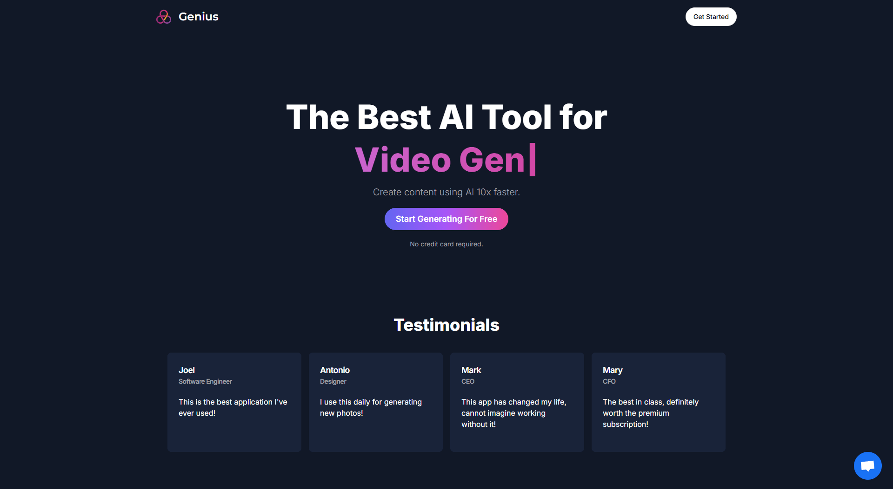
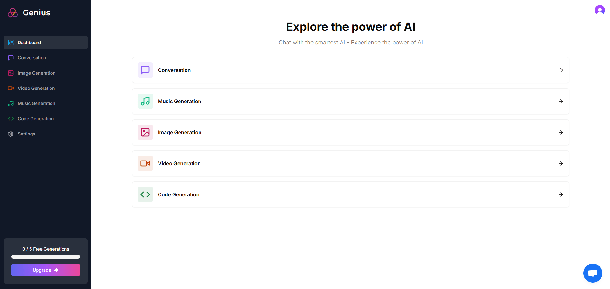
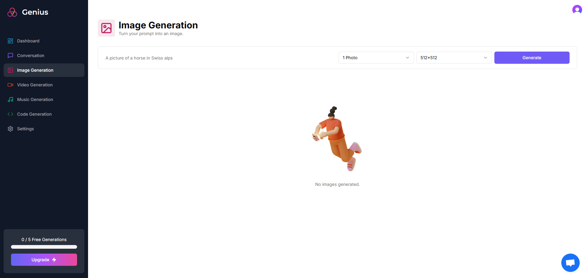

# SaaS AI Platform

## Screenshots





## Technologies Used:

-   typescript
-   next.js v13
-   tailwindcss
-   shadcn/ui
-   prisma
-   stripe
-   clerk
-   zustand
-   zod
-   axios
-   react-hook-form
-   react-toast
-   Crisp
-   Open AI
-   Replicate AI

## Features:

-   Tailwind design
-   Tailwind animations and effects
-   Full responsiveness
-   Clerk Authentication (Email, Google, 9+ Social Logins)
-   Client form validation and handling using react-hook-form
-   Server error handling using react-toast
-   Image Generation Tool (Open AI)
-   Video Generation Tool (Replicate AI)
-   Conversation Generation Tool (Open AI)
-   Music Generation Tool (Replicate AI)
-   Page loading state
-   Stripe monthly subscription
-   Free tier with API limiting

## How to use

-   Clone the project
-   Install Node Js (v18.8.0)
-   Run `npm install` to current directory
-   Rename **_.env.example_** to **_.env_** and fill in all key values

```dotenv
# -----------------------------------------------------------------------------
# App
# -----------------------------------------------------------------------------
NEXT_PUBLIC_APP_URL=http://localhost:3000
NEXT_PUBLIC_CRISP_WEBSITE_ID=

# -----------------------------------------------------------------------------
# Authentication (@clerk/nextjs)
# -----------------------------------------------------------------------------
CLERK_SECRET_KEY=
NEXT_PUBLIC_CLERK_PUBLISHABLE_KEY=
NEXT_PUBLIC_CLERK_SIGN_IN_URL=/sign-in
NEXT_PUBLIC_CLERK_SIGN_UP_URL=/sign-up
NEXT_PUBLIC_CLERK_AFTER_SIGN_IN_URL=/dashboard
NEXT_PUBLIC_CLERK_AFTER_SIGN_UP_URL=/dashboard

# -----------------------------------------------------------------------------
# Database (MySQL - PlanetScale)
# -----------------------------------------------------------------------------
DATABASE_URL=

# -----------------------------------------------------------------------------
# Subscriptions (Stripe)
# -----------------------------------------------------------------------------
STRIPE_API_KEY=
STRIPE_WEBHOOK_SECRET=

# -----------------------------------------------------------------------------
# Open AI and Replicate
# -----------------------------------------------------------------------------
OPENAI_API_KEY=
REPLICATE_API_TOKEN=
```

-   Setup Prisma

Add MySQL Database (I used [PlanetScale](https://planetscale.com/))

```shell
npx prisma db push
```

## Run app

In the project directory, you can run:

`npm run dev`

Runs the app in the development mode.

Open http://localhost:3000 to view it in your browser.
