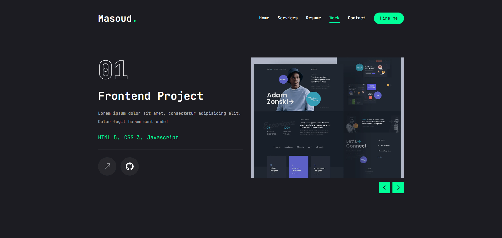

# Portfolio

## Screenshots

## Technologies Used:

-   next.js v14
-   react.js
-   tailwindcss
-   shadcn/ui
-   lucide-react
-   framer-motion
-   swiper
-   react-countup

## Features:

-   Tailwind design
-   Framer Motion animations and effects
-   Full responsiveness

## How to use

-   Clone the project
-   Install Node Js (v20.15.0)
-   Run `npm install` to current directory

## Run app

In the project directory, you can run:

`npm run dev`

Runs the app in the development mode.

Open http://localhost:3000 to view it in your browser.
